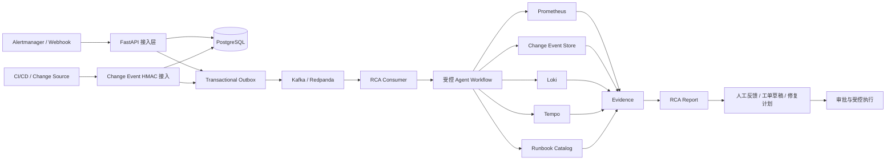

# DevOps 智能排障 Agent 平台

> 生产导向的 Incident / 受控 RCA 作业编排平台。
> 它不是自由式自主 Agent，也不是通用自动修复引擎。

平台把告警接入、Incident 管理、只读证据采集、RCA 报告、人工反馈、工单草稿和审批式修复计划串成一条可审计链路。核心工程能力包括 Outbox、幂等、租约、Owner/Attempt Fence、审批门禁、低基数监控和敏感信息脱敏。

默认 RCA 使用服务端发布的固定只读计划：

```text
Metrics → Change → Logs → Traces → Runbooks → Evidence → RCA Report
```

LLM 只负责生成供人工复核的结构化候选报告，不能把根因标记为 `CONFIRMED`。告警接入也不会自动启动 RCA，必须由授权操作员显式触发，或由未来单独接线的策略开关触发。

## 快速导航

| 内容 | 入口 |
|---|---|
| 当前完成度与禁止话术 | [缺少内容.md](缺少内容.md) |
| Step 4 验收 | [STEP4_ACCEPTANCE.md](STEP4_ACCEPTANCE.md) |
| Step 5 部署与生产化资产 | [STEP5_PRODUCTION.md](STEP5_PRODUCTION.md) |
| Step 6 产品化边界 | [STEP6_PRODUCTIZATION.md](STEP6_PRODUCTIZATION.md) |
| 最小改造总计划 | [docs/remediation-roadmap-master-plan.md](docs/remediation-roadmap-master-plan.md) |
| MiniShop 端到端 RCA 导读 | [docs/minishop-e2e-rca-code-tour.md](docs/minishop-e2e-rca-code-tour.md) |
| Change Event 到 RCA 闭环 | [docs/change-event-rca-loop.md](docs/change-event-rca-loop.md) |
| Benchmark 基础评分闭环 | [docs/evaluation-benchmark-foundation.md](docs/evaluation-benchmark-foundation.md) |
| 部署说明 | [ops/deploy/README.md](ops/deploy/README.md) |
| 运维 Runbook | [ops/runbooks](ops/runbooks) |

## 项目定位与诚实边界

面试、设计评审和项目介绍建议使用下面这句话：

> 这是一个生产导向的 Incident / RCA 作业编排后端：通过固定只读调查计划收集可追溯 Evidence，使用 Outbox、租约、幂等和审批机制保证关键流程可靠，并支持可选 LLM 报告封装和人工审核修复计划。

可以说明平台已经具备：

- 固定、受权限控制的只读 RCA 调查计划；
- 可选的部分采集降级和置信度护栏；
- PostgreSQL、Kafka、Prometheus、Loki、Tempo 的端口与适配器；
- 工单提交、人工反馈、审批式修复计划和 MiniShop 演练闭环；
- 可本地验证的测试、迁移、镜像、SBOM 和安全扫描门禁。

不能宣称：

- 已承载真实生产流量；
- Agent 会自由选择工具并进行自适应多轮推理；
- Prompt Registry、Feature Flag、RAG 或反馈评测闭环已经在线自动运行；
- 平台能够自动接管、重试任意外部写操作；
- 本地 Compose、Mock 或单元测试等同于 staging / production 签字。

仓库中的 Prompt Registry、Feature Flag 和 RAG 资产属于 `Example Or Blueprint Only / Not Loaded By Runtime`，中文含义是“仅示例或治理蓝图，运行时未接线”。

## 当前完成状态

| 阶段 | 当前状态 | 仍需补齐 |
|---|---|---|
| Step 4 工程主链路 | 已实现并可重复本地验证 | 真实 PostgreSQL、Kafka、OIDC、观测源、LLM、工单系统的目标环境签字 |
| Step 5 生产化资产 | 已提供 Docker、Compose、Kubernetes 骨架、CI、安全门禁和运维手册 | 真实拓扑、容量压测、故障注入、备份恢复演练证据 |
| Step 6 产品面 | 已实现 Ops Console、反馈 API、离线评测门禁、工单和修复计划能力 | 在线多审核人策展、自动匿名化、真实 Web 产品和运行时 Prompt/Flag/RAG |

完整真相源见 [缺少内容.md](缺少内容.md)。若其他文档与它冲突，以该文件为准。

## 系统架构



代码按职责分层：

- `interfaces`：HTTP DTO、路由、中间件和异常响应；
- `application`：用例命令、查询和业务编排服务；
- `domain`：纯领域模型、枚举、状态机和领域异常；
- `ports`：应用层依赖的出站契约；
- `infrastructure`：数据库、Kafka、OIDC、观测、LLM、工单和修复适配器；
- `agent`：固定调查计划、工作流执行和报告生成；
- `tools`：工具定义、版本注册、权限、风险和只读执行门禁；
- `ops`：部署、监控、Runbook、评测、MiniShop E2E 和修复沙箱资产。

## 核心业务流程

### 1. 告警到 Incident

1. Alertmanager 通过 `POST /api/v1/alerts` 发送告警。
2. 生产路径要求 HMAC-SHA256 Webhook 鉴权和时间窗口校验。
3. `external_event_id` 提供重试幂等；摘要在入库前完成归一化和脱敏。
4. PostgreSQL 事务内完成告警持久化、Incident 关联和 Outbox 事件写入。

### 2. Incident 到 RCA

1. 具有 `incidents:rca` 权限的操作员显式创建 RCA。
2. 事务内把 Incident 置为分析中、创建 `WorkflowRun` 并写入 `rca.requested` Outbox。
3. Kafka Consumer 领取任务；执行 Claim 带 Worker、Attempt 和过期租约。
4. Agent 按固定计划调用只读工具，并将有界、脱敏后的结果保存为 Evidence。
5. 工作流完成使用 Worker/Attempt Fence，迟到结果不能覆盖新接管者。
6. 报告使用确定性生成器或可选 LLM，最终仍受 Evidence 引用和结论状态约束。

### 3. RCA 后续操作

- 人工反馈：持久化、审计和只读评测候选导出，不会自动训练或发布模型；
- 工单草稿：从 Incident 和 RCA 报告派生，审批后通过 Outbox 异步请求外部工单；
- 修复计划：先校验证据、动作目录和维护窗口，再执行人工审批；
- 外部修复：只允许预注册动作键和固定控制器地址，不接受任意 Shell、SSH、Kubernetes 或云命令。

## 可靠性与安全机制

### 工作流可靠性

- Transactional Outbox 避免数据库提交成功但消息丢失；
- 幂等键、请求指纹和 ETag 防止重复写和并发覆盖；
- RCA、Outbox、审计清理和 Remediation Worker 都有有界批次与协作式停止；
- RCA 执行使用 Claim、Lease、Heartbeat 和 Owner/Attempt Fence；
- Remediation 执行与回滚使用独立 Attempt 和 Lease，过期任务只收口失败，不自动重放外部写；
- Kafka 使用手工提交、可重试回退和 Dead Letter 先写后提交语义。

### 输入与隐私边界

- 租户、Incident、Workflow、操作员和 Worker 标识禁止空白与 ASCII 控制字符；
- `Idempotency-Key`、OIDC Claim、Kafka 元数据和外部 URL 均在进入业务层前校验；
- 日志、Evidence、报告、工单和故障原因在存储或输出前重复脱敏；
- 默认 API 不返回原始 Evidence Payload、请求指纹、幂等哈希或第三方原始错误；
- 指标标签保持低基数，不使用租户、Trace、Workflow、Ticket 或分区 ID。

### 权限与认证

- 管理接口使用可插拔 Bearer Authenticator；未配置时默认失败关闭；
- OIDC 采用非对称 JWT 校验，检查 issuer、audience、时间声明和 JWKS；
- 工具权限按租户和操作员校验，授权来源不可用与明确拒绝使用不同错误语义；
- Webhook 生产路径使用 HMAC-SHA256，固定演练 Token 在 `prod` / `production` 环境会被拒绝。

## RCA 调查策略

部署可以选择三种服务端固定计划：

| 策略 | 调查步骤 | 适用环境 |
|---|---|---|
| `fixed_default` | Metrics → Change → Logs → Traces → Runbooks | Prometheus、Change Store、Loki、Tempo 均可用 |
| `fixed_no_traces` | Metrics → Change → Logs → Runbooks | 没有 Tempo |
| `fixed_metrics_logs_runbooks` | Metrics → Logs → Runbooks | 显式强调无 Change/Trace 的基线流程 |

这些策略是部署时选择的静态计划，不是运行时自适应工具选择。

`continue_on_step_failure` 默认关闭。显式开启后，只读步骤失败可以继续采集其他证据，但仍满足以下护栏：

- 零 Evidence 时整体失败，不生成假报告；
- 报告摘要列出失败步骤；
- 部分报告置信度最高为 `0.4`；
- 结论不能为 `CONFIRMED`。

## LLM 报告能力

LLM 报告默认关闭。开启后可以配置有序 Provider 链，推荐 OpenAI → DashScope → 确定性生成器。缺少凭据的 Provider 会跳过，超时、拒绝、非法结构、伪造 Evidence 引用或敏感输出会进入下一个 Provider，全部失败后回退到 `UNDETERMINED` 确定性报告。

示例配置：

```text
DEVOPS_AGENT_LLM_REPORT_ENABLED=true
DEVOPS_AGENT_RCA_CONSUMER_ENABLED=true
DEVOPS_AGENT_LLM_PROVIDER_ORDER=openai,dashscope

DEVOPS_AGENT_LLM_OPENAI_API_STYLE=responses
DEVOPS_AGENT_LLM_OPENAI_MODEL=approved-openai-model
DEVOPS_AGENT_LLM_OPENAI_API_KEY=inject-from-secret-manager

DEVOPS_AGENT_LLM_DASHSCOPE_API_STYLE=chat_completions
DEVOPS_AGENT_LLM_DASHSCOPE_MODEL=qwen3.7-plus
DEVOPS_AGENT_LLM_DASHSCOPE_API_KEY=inject-from-secret-manager
```

支持的 Provider 名称为 `openai`、`dashscope`、`openai_compatible` 和 `custom`。旧版单 Provider 环境变量仍保留兼容，但新部署建议使用有序 Provider 配置。

## MiniShop 端到端故障演练

仓库内置 MiniShop 电商下单故障演练靶场，用于跑通真实的本地告警到 RCA 路径：

```text
MiniShop → Prometheus / Loki / Tempo → Alertmanager → 平台 → Kafka → RCA → Ground Truth 评测
```

四个机器可读场景覆盖典型的下单故障，并通过 Manifest 与 Ground Truth 校验 RCA 报告：
`checkout-latency`、`inventory-db-timeout`、`payment-error` 和
`deployment-regression`。发布回归场景要求 Change、Metric、Log、Trace 共同归因；
其他场景允许 Change 查询为空，不能因为历史部署记录单独改变根因。

在 PowerShell 中执行：

```powershell
.\ops\minishop-e2e\run-e2e.ps1
```

Runner 会重建隔离 Compose 栈、发布演练 Runbook、注入故障、等待 Incident/RCA、评测结果并写入：

```text
ops/minishop-e2e/artifacts/results.json
```

仅在排查容器现场时使用 `-KeepStack`。演练固定管理员 Token 默认关闭、与 OIDC 互斥，并且不是生产认证方案。

### Benchmark 基础评分闭环

现有四个 Manifest 已扩展根因类型、Evidence 类型、有向因果边、影响服务以及期望/
禁止工具。独立 Scorer 可以对结构化 Prediction 计算 RCA、Evidence、Claim、因果链、
影响面和 Tool 指标，并生成 `results.json` 与中文 `evaluation-report.md`。

运行 deterministic contract fixture：

```powershell
uv run python -m ops.evaluation.run_benchmark `
  --scenarios '.\MiniShop 电商下单故障演练靶场\scenarios' `
  --input '.\ops\evaluation\fixtures\minishop-v1-predictions.json' `
  --output '.\ops\evaluation\artifacts\contract-fixture-001'
```

该 fixture 只验证评分合同，不是实时 E2E 或真实 LLM 准确率。完整设计、指标和未实现
边界见 [Benchmark 基础评分闭环](docs/evaluation-benchmark-foundation.md)。

## 本地开发

### 环境要求

- Python 3.11 或 3.12；
- `uv==0.11.31`；
- 需要运行完整演练时安装 Docker Desktop 或 Podman。

安装锁定的包管理器并同步依赖：

```powershell
python -m pip install uv==0.11.31
uv sync --locked --extra dev
```

运行平台测试：

```powershell
uv run pytest -q -m "not live"
uv run ruff check .
```

运行 MiniShop 测试：

```powershell
Set-Location '.\MiniShop 电商下单故障演练靶场'
uv sync --locked --extra dev
uv run pytest -q
```

启动本地 API：

```powershell
uv run uvicorn main:app --reload
```

执行数据库迁移：

```powershell
uv run alembic upgrade head
```

`uv.lock` 是平台可复现依赖基线，MiniShop 拥有独立锁文件。修改依赖约束后使用 `.\scripts\update-lockfiles.ps1` 更新锁文件；只有明确升级依赖时才传入 `-Upgrade`。CI 使用 `uv sync --locked` 拒绝过期锁文件。

## 发布与供应链门禁

`pyproject.toml` 是平台版本号唯一真相源。安装包中的 `devops_agent_platform.__version__`、FastAPI/OpenAPI、根 `uv.lock` 和 Kubernetes 示例镜像 Tag 都由测试约束为同一版本。

发布 Annotated Tag 前执行：

```powershell
uv build --out-dir dist
uv run python scripts/check-release-version.py `
  --tag v0.3.4 --dist-dir dist
```

Tag 流水线依次执行：

1. Python 3.12 主测试、Ruff、MiniShop 测试和 Alembic 离线迁移；
2. Python 3.11 兼容性测试和 Alembic 离线迁移；
3. 平台与 MiniShop 锁定生产依赖的 `pip-audit --strict` 审计；
4. Trivy 仓库密钥扫描；
5. 非 Root 镜像构建、SPDX SBOM 生成和高危漏洞门禁；
6. 发布 wheel、sdist、`sbom.spdx.json` 和覆盖全部载荷的 `SHA256SUMS`。

发布器支持安全重试：远端同名同内容资产直接保留，缺失资产补传，同名不同内容立即失败。只有最终 Release Job 拥有 `contents: write`，前置 Job 全部只读。所有第三方 GitHub Action 均固定到经过审查的完整 40 位 Commit SHA。

## v0.3.4 相比 v0.3.3 的完善

`v0.3.4` 不改变业务 API 或 Remediation 状态机语义，重点完善发布兼容性和供应链证据：

- 新增 Python 3.11 独立兼容性 Job，覆盖非 Live 全量测试和 Alembic 离线迁移；
- 新增安全 Job，分别审计平台与 MiniShop 的锁定生产依赖；
- 将 `cryptography` 锁定版本升级到 `50.0.0`，修复 `PYSEC-2026-3552`；
- 将 `uv` 与其构建依赖隔离在 Builder 环境，避免 `msgpack`、`setuptools` 进入运行时镜像；
- Runtime 构建阶段升级 Debian 安全补丁并清理 APT 索引，修复基础镜像中可升级的高危项；
- 新增 Trivy 文件系统密钥扫描，并把安全门禁加入镜像构建前置依赖；
- 镜像 SBOM 作为 CI Artifact 保留，并在 Tag 发布时作为正式 GitHub Release 资产下载；
- 发布器在任何 GitHub API 写操作前校验 SPDX 2.x 文档结构、文档 ID 和非空 Package 清单；
- wheel、sdist 和镜像 SBOM 统一进入 `SHA256SUMS`；
- Release 同名资产继续保持内容一致性校验和幂等补传；
- Kubernetes Deployment、Migration Job、项目版本和锁文件统一到 `0.3.4`；
- 增加 CI、Action SHA、SBOM、版本和发布资产契约测试；
- 更新发布 Runbook，要求验收 wheel、sdist、SBOM 和校验和文件。

这些改动提升了版本可追溯性，但不等于目标环境已经完成生产验收。真实部署仍必须补齐 OIDC、Kafka、观测源、LLM、工单系统、外部修复控制器、容量和故障注入证据。

## 部署与监控资产

- Docker：`Dockerfile`、`.dockerignore`；
- 本地生产化演练：`ops/deploy/docker-compose.yml`；
- Kubernetes 骨架：`ops/deploy/kubernetes/`；
- 环境变量清单：`.env.example`、`ops/deploy/env.production.example`；
- 发布与回滚：`ops/deploy/release-runbook.md`；
- 容量与 SLO：`ops/deploy/capacity-and-slo.md`；
- 备份恢复：`ops/deploy/backup-restore.md`；
- Prometheus 规则：`ops/prometheus/rules/`；
- Alertmanager：`ops/alertmanager/`；
- Grafana：`ops/grafana/`；
- 故障 Runbook：`ops/runbooks/`。

在安装 Prometheus 的环境中校验规则：

```powershell
promtool check rules ops/prometheus/rules/*.yml
```

Alertmanager Slack Webhook 必须以 Secret 文件挂载：

- `/run/secrets/alertmanager-slack-critical-url`；
- `/run/secrets/alertmanager-slack-warning-url`。

## 上线前必须完成

以下内容不能通过本地 Mock 或文档替代：

1. 真实 PostgreSQL、Kafka、OIDC、Prometheus、Loki、Tempo、LLM 和 Ticketing 的 staging/sandbox 验收；
2. HTTPS OIDC issuer、JWKS、audience、Token 和证书链验证；
3. 1x、2x 和峰值流量下的 k6 压测报告；
4. 故障注入后的恢复时间、重复/丢失、Consumer Lag、Outbox Backlog、CPU 和内存证据；
5. 外部修复控制器的白名单、审批、超时、回滚和租约过期演练；
6. 组织级数据集存储、匿名化、多审核人签字和模型发布流程。

在这些证据完成前，项目的准确定位仍是：

> 生产导向的 Incident / 受控 RCA 作业编排平台，而不是已生产上线的自适应智能排障 Agent。
