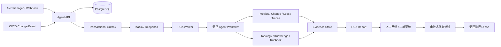

# DevOps 智能排障 Agent 平台

面向云原生系统的 Incident 管理、证据采集、根因分析（RCA）和受控处置平台。

平台将告警接入、Incident 聚合、只读调查、证据归档、结构化 RCA 报告、人工反馈、工单草稿和审批式修复串成一条可审计工作流。Agent 的调查范围、工具权限、预算、超时和结果状态由后端控制，LLM 负责候选判断和解释，不直接获得 Shell、SQL、Kubernetes 或任意外部写操作权限。

## 核心能力

- 告警接入：Webhook HMAC 校验、时间窗口、幂等键、租户隔离和 Alert Storm 聚合；
- Incident 工作流：Incident、WorkflowRun、Evidence、Outbox 和审计事件持久化；
- RCA 调查：固定只读计划与 `bounded_dynamic_v1` 有界动态调查策略；
- 多源证据：Prometheus Metrics、Change Event、Loki Logs、Tempo Traces、Topology、Historical Knowledge 和 Runbook；
- 根因推理：Root Cause Taxonomy、候选生成、Support/Contradiction、资源归一化、因果链和影响面计算；
- LLM 集成：OpenAI-compatible Chat Completions、DashScope 千问、结构化 JSON Schema、成本和延迟记录；
- 工作流可靠性：Transactional Outbox、Kafka/Redpanda、Claim、Lease、Heartbeat、Owner/Attempt Fence 和 Checkpoint/Resume；
- 处置治理：工单草稿、人工反馈、双人审批、动作白名单、租约和回滚边界；
- 平台接口：Workspace 管理、Dataset Release、HTTP MCP Adapter 和组织级评测资产；
- 评测与演练：MiniShop 故障靶场、Known Black-box E2E、Public/Private Scenario Split、Hidden Holdout 泛化、Benchmark Integrity 和容量/Chaos Harness；
- 可观测性：RCA 完成率、工具调用、LLM 成本、Lease 回收、Partial Report、Outbox 和 Consumer Lag 指标。

## 系统架构



代码按职责分层：

```text
interfaces       HTTP DTO、路由、中间件和统一响应
application      用例、命令、查询和业务编排
domain           领域模型、状态机、枚举和领域异常
ports            应用层依赖的端口契约
infrastructure   PostgreSQL、Kafka、OIDC、观测、LLM 和 Ticketing 适配器
agent            固定调查、有界动态调查、工作流和报告生成
tools            工具注册、权限、风险和只读执行边界
ops              部署、评测、Benchmark、MiniShop、负载和故障演练
```

## 快速开始

### 环境要求

- Python 3.11 或 3.12；
- `uv==0.11.31`；
- Docker Desktop 或兼容的 Docker Compose；
- 调用真实千问 Benchmark 时，需要 DashScope API Key。

### 安装依赖

```powershell
python -m pip install uv==0.11.31
uv sync --locked --extra dev
```

### 配置环境变量

复制 `.env.example` 为 `.env`，按需填写数据库、OIDC、Kafka、观测和 LLM 配置。使用千问 API 时配置：

```text
DEVOPS_AGENT_LLM_DASHSCOPE_API_KEY=你的 DashScope API Key
DEVOPS_AGENT_LLM_DASHSCOPE_MODEL=qwen3.7-plus
DEVOPS_AGENT_LLM_DASHSCOPE_API_STYLE=chat_completions
```

平台通过 DashScope OpenAI-compatible API 调用模型，不需要本地模型服务。

### 启动 API

```powershell
uv run alembic upgrade head
uv run uvicorn main:app --reload
```

健康检查：

```powershell
Invoke-WebRequest http://127.0.0.1:8000/readyz
Invoke-WebRequest http://127.0.0.1:8000/metrics
```

## Reference Staging

Reference staging 使用 PostgreSQL、Redpanda、OIDC/JWKS、Prometheus、Loki、Tempo、MCP、Agent 和 Ticketing 服务组成完整演练栈：

```powershell
docker compose `
  --project-name devops-agent-reference `
  --env-file ops/reference-staging/.env.example `
  -f ops/reference-staging/docker-compose.yml up -d --build

uv run python ops/reference-staging/run_acceptance.py `
  --compose-file ops/reference-staging/docker-compose.yml
```

详细配置和验收入口见 [ops/reference-staging/README.md](ops/reference-staging/README.md)。

## MiniShop 故障演练靶场

MiniShop 是配套的电商下单故障演练应用，覆盖支付错误、连接池耗尽、配置回归、级联故障、Redis 延迟、第三方超时和误报等场景。

```powershell
Set-Location '.\MiniShop 电商下单故障演练靶场'
uv sync --locked --extra dev
uv run pytest -q
```

场景 Manifest 位于 `MiniShop 电商下单故障演练靶场/scenarios/`，每个场景包含注入接口、清理接口、告警映射、Evidence 断言、Ground Truth、因果链、影响服务和工具约束。

## RCA Benchmark

v0.7 将评测分为 Contract、Known Black-box E2E、Hidden Generalization 三层。Contract
夹具只验证协议和评分器；Known/Hidden 的正式指标必须来自真实 Fault Injection、平台
Workflow terminal、Runtime Evidence、ToolInvocation 和真实 Provider。当前工作区提供
Public/Private 目录、10 个 Hidden Holdout、真实 Holdout Fault Router、扰动 Runner、
Leakage Guard、黑盒 Runtime Snapshot 和报告生成器。任何准确率、成本或延迟数字都必须
从对应正式输出目录的 `results.json`/`benchmark-provenance.json` 读取后再发布。

2026-08-22 本地正式批次已完成并由 `resume-metrics.json` 自动汇总：Known Clean
60 次 RCA Top-1 为 96.67%，Hidden Holdout 50 次为 86.00%，Generalization Gap
为 10.67pp；同源 Clean 为 90.00%，30% Noise 为 86.00%（下降 4.00pp）。
Unsupported Claim 与 Cross-Incident Evidence Leak 均为 0。Missing Logs 的 50 次
输出全部安全降级为 `UNDETERMINED`、0 置信度且未产生 `application_error` 硬猜；
Multi-Incident 5/5 Pair、10/10 Workflow 成功且 RCA Top-1/Strict 100%。正式报告位于
本机 D 盘 `v07-generalization-report-final-20260822T1230-r9` 输出目录，指标不可脱离该目录的
`benchmark-provenance.json` 与原始 Prediction 单独引用。

### 本地结构化评测

```powershell
$env:PYTHONPATH='.'
uv run python -m ops.evaluation.run_benchmark `
  --scenarios 'MiniShop 电商下单故障演练靶场/scenarios' `
  --input ops/evaluation/fixtures/minishop-v1-predictions.json `
  --output D:\DevOpsAgentSimulation\benchmark-contract
```

### 真实千问评测

```powershell
$env:DEVOPS_AGENT_BENCHMARK_API_KEY=$env:DEVOPS_AGENT_LLM_DASHSCOPE_API_KEY
uv run python -m ops.evaluation.run_live_benchmark `
  --scenarios 'MiniShop 电商下单故障演练靶场/scenarios' `
  --input D:\DevOpsAgentSimulation\simulation-runtime-inputs.json `
  --output D:\DevOpsAgentSimulation\benchmark-qwen `
  --git-commit $(git rev-parse --short HEAD) `
  --provider dashscope `
  --model qwen3.7-plus `
  --base-url https://dashscope.aliyuncs.com/compatible-mode/v1 `
  --api-key-env DEVOPS_AGENT_BENCHMARK_API_KEY `
  --input-cost-per-million 2 `
  --output-cost-per-million 8 `
  --runs-per-scenario 5 `
  --max-concurrency 1 `
  --max-retries 2
```

评测输出包括 `results.json`、`predictions.json`、`evaluation-report.md`、`bad_cases.jsonl`、
`root-cause-error-breakdown.json` 和（正式 v0.7 运行）`benchmark-provenance.json`。核心指标包括
RCA Top-1、Strict RCA、Root Service/Type/Resource、Candidate Recall@3、MRR、Evidence Recall、
Causal Chain F1、Blast Radius F1、Unsupported/Forbidden Claim、False Confirmation、Undetermined
Precision/Recall、Calibration ECE/Brier、Tool Selection、Token、Cost 和 P50/P95 延迟。

## 生产级本地仿真

`ops/simulation` 使用真实开源基础组件搭建隔离仿真环境，并通过根 `.env` 调用千问 API：

```powershell
uv run python -m ops.simulation.run_simulation `
  --env-file ops/simulation/.env.example `
  --output-root D:\DevOpsAgentSimulation\production-like-<timestamp> `
  --load-duration-seconds 60 `
  --completion-probe-count 3
```

仿真流程执行协议验收、Ticketing 幂等、12×5 RCA、100/500/1000 alerts/min 负载、RCA completion probe、Worker/Kafka/PostgreSQL/观测故障注入，并输出完整证据目录。

当前验证结果：

| 指标 | 结果 |
|---|---:|
| RCA Benchmark | 60/60 通过 |
| RCA Top-1 / Strict RCA | 100% / 100% |
| Evidence / 因果链 / 影响面 | 100% / 100% / 100% |
| RCA completion rate | 100%（1/1） |
| 100/500/1000 alerts/min | 99.976 / 499.993 / 999.979 |
| 全量测试 | 1930 passed, 9 skipped（本轮门禁） |

完整实施过程、数据构建和测评说明见 [生产级本地仿真环境实施与测评报告.md](生产级本地仿真环境实施与测评报告.md)。五变体消融入口：

```powershell
uv run python -m ops.simulation.run_ablation `
  --env-file ops/simulation/.env.example `
  --output-root D:\DevOpsAgentSimulation\ablation-<timestamp>
```

## 测试与质量检查

```powershell
uv run ruff check src ops tests
$env:PYTHONPATH='.'
uv run pytest -q
uv lock --check
git diff --check
```

本项目使用 `pytest`、`ruff`、Alembic 迁移检查、Compose 配置检查、供应链扫描、SBOM 和 Release 版本门禁。
正式 Known 黑盒运行已完成 12 个场景 × 5 次 Fault Injection/Workflow terminal；由于本轮
受限会话无法读取 D 盘结果目录，未把该批次的准确率或 LLM/fallback 比例写入项目指标。

## 发布

项目版本以 `pyproject.toml` 为准，构建和版本校验命令：

```powershell
uv build --out-dir dist
uv run python scripts/check-release-version.py `
  --tag v0.7.0 --dist-dir dist
```

CI 发布流程会生成 wheel、sdist、SBOM 和 SHA256 校验和，并使用 Annotated Tag 关联版本说明。

## 部署资产

- Docker：`Dockerfile`、`.dockerignore`；
- Compose：`ops/deploy/docker-compose.yml`；
- Kubernetes：`ops/deploy/kubernetes/`；
- 环境变量：`.env.example`、`ops/deploy/env.production.example`；
- 发布 Runbook：`ops/deploy/release-runbook.md`；
- 容量与 SLO：`ops/deploy/capacity-and-slo.md`；
- 备份恢复：`ops/deploy/backup-restore.md`；
- Prometheus：`ops/prometheus/rules/`；
- Grafana：`ops/grafana/`；
- 故障 Runbook：`ops/runbooks/`。

## 文档导航

| 文档 | 内容 |
|---|---|
| [生产级本地仿真环境实施与测评报告.md](生产级本地仿真环境实施与测评报告.md) | 真实组件、千问 API、数据构建、评测方法和指标 |
| [docs/local-high-fidelity-simulation-acceptance.md](docs/local-high-fidelity-simulation-acceptance.md) | 本地高保真仿真证据归档 |
| [docs/route-a-honest-narrative.md](docs/route-a-honest-narrative.md) | 平台定位与安全边界 |
| [docs/remediation-roadmap-master-plan.md](docs/remediation-roadmap-master-plan.md) | 处置链路改造路线 |
| [docs/minishop-e2e-rca-code-tour.md](docs/minishop-e2e-rca-code-tour.md) | MiniShop 端到端 RCA 代码导读 |
| [DevOps_Agent_Evaluation_Benchmark_实施规范.md](DevOps_Agent_Evaluation_Benchmark_实施规范.md) | Benchmark 场景、Ground Truth 和评分规范 |
| [云智实习场景_AIOps项目最终完善与简历包装任务书.md](云智实习场景_AIOps项目最终完善与简历包装任务书.md) | 项目实践与简历表达参考 |

## 项目结构

```text
├── src/devops_agent_platform/       平台核心代码
├── migrations/                       数据库迁移
├── ops/reference-staging/            Reference staging
├── ops/simulation/                   生产级本地仿真
├── ops/evaluation/                   Benchmark 与评测
├── ops/load/                         容量负载
├── ops/chaos/                        故障注入
├── MiniShop 电商下单故障演练靶场/    业务故障靶场
├── tests/                            单元与集成测试
└── docs/                             架构、验收和运维文档
```

## v0.6.0 相比 v0.5.0

`v0.6.0` 是 RCA 评测闭环和本地生产级仿真完善版本，重点优化和新增：

- 新增 RCA completion rate 观测器，将 Worker 终态提交接入 Prometheus 指标；
- 新增 RCA completion probe，打通告警、Incident、RCA、Worker、Kafka、PostgreSQL 和 Metrics 的真实链路；
- 修复容量报告中 `completion_rate=null` 无法参与端到端门禁计算的问题；
- 修复级联故障入口服务与根因服务相同时的传播边推导，稳定生成 `checkout-service -> payment-service`；
- 修复 Scenario Manifest 中 topology/knowledge 工具声明与运行时 Evidence 不一致的问题；
- 修复 `knowledge.search@v1` 工具映射，新增 Benchmark shard 合并器和 SHA-256 provenance；
- 新增完整的中文生产级本地仿真实施与测评报告；
- 完善真实千问 12×5 评测、成本/延迟、容量和故障恢复证据归档；
- 更新 Kubernetes 镜像标签、`uv.lock`、Release 版本门禁和项目文档到 `0.6.0`；
- 全量测试达到 `1910 passed, 9 skipped`，Ruff 和锁文件检查保持通过。

## 许可证

本项目用于 DevOps/AIOps 工程实践、故障演练和评测研究。具体授权条款以仓库发布的许可证文件为准。
