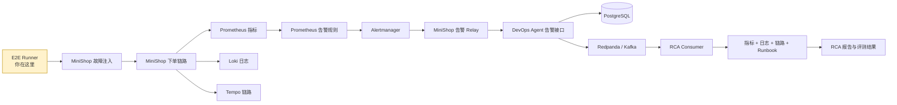
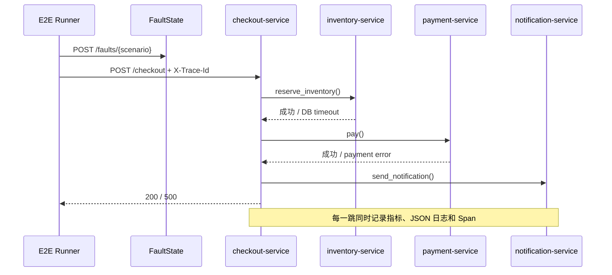
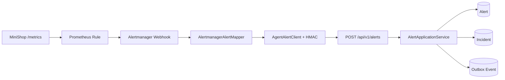
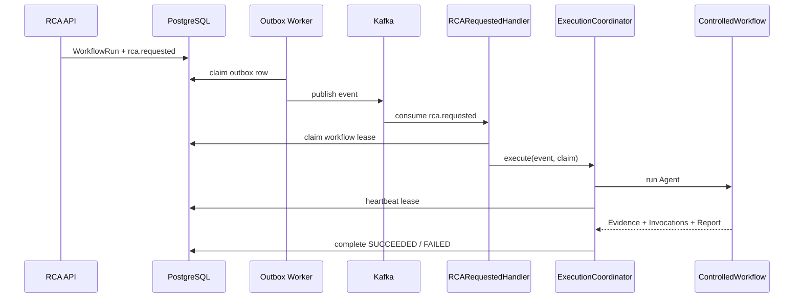

# MiniShop 到 DevOps Agent 的端到端 RCA 代码导读

## 一句话概括

这个项目把一个可注入故障的 MiniShop 电商服务接入真实可观测系统，再由 DevOps Agent 自动收集指标、日志、链路和 Runbook，最终形成可评测的 RCA（根因分析）报告。

## 业务背景：为什么需要这条链路

线上故障排查通常不是“看一条报错就结束”，而是要回答四个问题：

1. 告警是否真的对应一次业务故障？
2. 哪个服务、哪类依赖最先异常？
3. 指标、日志、链路和操作手册能否互相印证？
4. Agent 给出的根因是否命中 Ground Truth，而不是编造一个听起来合理的故事？

MiniShop 是可控的“事故现场”，三个 JSON Manifest 是“标准答案”，DevOps Agent 是“调查员”，E2E Runner 则是“考官”。

## 项目全景图

### 两条容易混淆的线

- 告警线：MiniShop 指标 → Prometheus 规则 → Alertmanager → Relay → 平台 Incident。
- RCA 证据线：RCA Consumer → Prometheus/Loki/Tempo/Runbook → Evidence → LLM 报告。

Alertmanager 负责“叫醒调查员”，四类工具负责“给调查员取证”。两者不是同一条请求。

## 技术栈速览

| 维度 | 技术选型 | 大白话解释 |
|---|---|---|
| 服务语言 | Python 3.11+ | MiniShop、平台和 E2E Runner 使用同一语言 |
| HTTP 框架 | FastAPI | 把函数变成 HTTP 接口，并负责请求校验和生命周期 |
| 数据库 | PostgreSQL + SQLAlchemy | 保存告警、Incident、Workflow、Evidence 和权限 |
| 事件流 | Redpanda / Kafka | 把“开始 RCA”可靠交给后台消费者异步执行 |
| 指标 | Prometheus | 定时抓取数值并按规则产生告警 |
| 日志 | Promtail + Loki | 收集 JSON 日志并按租户、服务查询 |
| 链路 | OpenTelemetry + Tempo | 把一次请求跨 checkout、inventory、payment 的耗时串起来 |
| 报告 | OpenAI-compatible LLM Stub | E2E 中用确定性 Stub 验证报告契约，不依赖真实模型 |
| 部署 | Docker Compose | 一次启动整套演练依赖 |

## 第一层：MiniShop 是怎样制造“可解释故障”的

### 核心文件

| 文件 | 职责 | 优先级 |
|---|---|---|
| `MiniShop 电商下单故障演练靶场/app/main.py` | 应用入口、中间件、健康检查、指标接口、路由装配 | ⭐⭐⭐ |
| `MiniShop 电商下单故障演练靶场/app/services.py` | checkout、inventory、payment、notification 业务编排 | ⭐⭐⭐ |
| `MiniShop 电商下单故障演练靶场/app/faults.py` | 保存故障开关、持续时间和延迟参数 | ⭐⭐⭐ |
| `MiniShop 电商下单故障演练靶场/app/metrics.py` | 输出平台可查询的业务指标 | ⭐⭐ |
| `MiniShop 电商下单故障演练靶场/app/logging.py` | 输出带 `tenant_id`、`service_name`、`trace_id` 的 JSON 日志 | ⭐⭐ |
| `MiniShop 电商下单故障演练靶场/app/tracing.py` | 给四个逻辑服务创建 OpenTelemetry Span | ⭐⭐ |
| `MiniShop 电商下单故障演练靶场/app/scenario_manifest.py` | 校验场景 Manifest 和 Ground Truth | ⭐⭐⭐ |

### 一次下单如何流过 MiniShop

主干从 `services.py:117` 的 `checkout()` 开始。它依次调用库存、支付和通知。故障不是随机撒在代码里，而是统一从 `FaultState` 读取：

- `payment_error`：支付服务返回失败，并产生错误计数、错误日志和 ERROR Span。
- `db_timeout`：库存服务等待后超时，并让 checkout 记录下游失败。
- `latency`：checkout 主链路主动变慢，直方图和 Trace 都能看到高延迟。

### 为什么要同时记录三类信号

指标告诉你“问题多大”，日志告诉你“代码当时说了什么”，Trace 告诉你“时间花在哪一跳”。单看其中一种，根因都可能不完整。

## 第二层：Manifest 是演练契约，不只是测试数据

三个场景位于：

- `MiniShop 电商下单故障演练靶场/scenarios/checkout-latency.json`
- `MiniShop 电商下单故障演练靶场/scenarios/inventory-db-timeout.json`
- `MiniShop 电商下单故障演练靶场/scenarios/payment-error.json`

`scenario_manifest.py:151` 的 `ScenarioManifest` 把一个场景拆为：

| 字段 | 作用 |
|---|---|
| `injection` | 怎样开启故障 |
| `trigger` | 怎样产生故障流量，以及期望 HTTP 状态 |
| `cleanup` | 无论成功失败都怎样恢复现场 |
| `expected_signals` | Prometheus、Loki、Tempo 或 HTTP 中应看到什么 |
| `ground_truth.required_evidence` | 哪些证据缺一不可 |
| `ground_truth.root_cause` | 期望根因、因果链和修复建议 |
| `ground_truth.forbidden_claims` | 报告中绝不能出现的错误结论 |

这里是重点：Manifest 同时驱动“执行”和“评分”。新增第四个场景时，不应在 Runner 中复制一套流程，而应优先扩展 Manifest。

## 第三层：告警怎样变成 Incident

### 告警链路

1. Prometheus 每 2 秒抓取 MiniShop `/metrics`。
2. `ops/minishop-e2e/alerts.yml` 对三个故障定义告警规则。
3. Alertmanager 把 firing webhook 发送到 MiniShop 的 `/integrations/alertmanager/webhook`。
4. `app/alertmanager.py:49` 将原生 Alertmanager 格式转换成平台 canonical alert DTO。
5. Relay 使用 HMAC 调用平台 `POST /api/v1/alerts`。
6. `AlertApplicationService.receive_alert()` 做幂等、Incident 聚合和 Outbox 事件写入。

`external_event_id` 由告警 fingerprint 和 `startsAt` 稳定生成，所以 Alertmanager 重投不会重复制造事故。平台侧仍再次做幂等检查，形成双保险。

## 第四层：为什么开始 RCA 要经过 Outbox 和 Kafka

平台入口在：

`src/devops_agent_platform/interfaces/http/routes/incidents.py`

路径是：

`POST /api/v1/admin/tenants/{tenant_id}/incidents/{incident_id}/rca`

`RCAApplicationService.start_rca()` 不直接在 HTTP 请求里跑 Agent。它只创建 WorkflowRun，并把 `rca.requested` 放入 Outbox。后台 Outbox Worker 再发布到 Kafka。

这样做的原因：

- HTTP 可以快速返回 `202 Accepted`。
- 消息失败可重试，不会丢掉 RCA 请求。
- 多个 Consumer 可以通过租约抢占，避免同一个 Workflow 重复执行。
- 工作流耗时、进程重启与用户请求生命周期解耦。

### 消费与租约链路

对应源码：

- 运行时装配：`bootstrap/rca_runtime.py:94`
- 消息抢占：`application/services/rca_requested_handler.py:81`
- 心跳、超时与终态：`application/services/rca_execution_coordinator.py:102`
- 资源统一启动/关闭：`bootstrap/runtime.py:286`、`bootstrap/runtime.py:371`

## 第五层：受控 Agent 为什么不是“模型想调什么就调什么”

`ControlledAgentWorkflow` 使用固定的四步只读计划：

1. `metrics.query@v1`
2. `logs.query@v1`
3. `traces.query@v1`
4. `runbooks.retrieve@v1`

计划定义在 `agent/controlled_workflow.py:680`。执行前会完成三类检查：

- 工具是否在 Registry 中注册；
- 操作员是否拥有工具需要的 permission tags；
- Payload 是否满足大小、字段和 JSON 边界。

执行时还受每步超时、总步骤数、结果大小和敏感文本清洗约束。任何一步失败都会记录失败 Invocation，并使工作流失败，而不是拿残缺证据伪装成功。

### 四类工具各自负责什么

| 工具 | Handler | 查询目标 | 产出 Evidence |
|---|---|---|---|
| `metrics.query` | `tools/handlers/metrics.py:146` | Prometheus | 请求量、错误率、延迟、可用性摘要 |
| `logs.query` | `tools/handlers/logs.py:117` | Loki | 脱敏、截断后的相关日志 |
| `traces.query` | `tools/handlers/traces.py:98` | Tempo | 慢 Trace、错误 Span、服务路径 |
| `runbooks.retrieve` | `tools/handlers/runbooks.py:41` | PostgreSQL Runbook Catalog | 已发布的处置步骤 |

工具先通过 `ObservabilityTargetResolver` 解析租户和服务，再生成受限查询模板。这个边界阻止模型直接拼任意 PromQL、LogQL 或 TraceQL。

## 第六层：Evidence、Invocation 和 Report 的区别

| 对象 | 回答的问题 | 失败时的作用 |
|---|---|---|
| Evidence | “查到了什么可信事实？” | 决定报告能引用哪些事实 |
| ToolInvocation | “工具是怎样被调用的？” | 审计超时、失败、输入和输出摘要 |
| RCA Report | “基于这些事实，候选根因是什么？” | 必须引用 Evidence ID，不能脱离证据 |

E2E 使用 `ops/minishop-e2e/llm_stub.py` 返回确定性候选结论。它不是为了模拟模型聪明程度，而是为了验证平台的结构化报告契约和证据绑定。

## 第七层：E2E Runner 怎样判定闭环真的成功

入口是 `ops/minishop-e2e/run_e2e.py:165` 的 `MiniShopE2ERunner`：

1. 等待 Agent、MiniShop、Prometheus、Loki、Tempo、Alertmanager 和 LLM Stub 健康。
2. 通过演练管理员 Token 配置四类只读工具权限。
3. 为三个场景创建并发布 Runbook。
4. 对每个场景执行 cleanup → injection → traffic → wait incident → start RCA。
5. 轮询 Workflow，要求终态为 `SUCCEEDED`。
6. 同时评价外部原始信号与平台内部 Evidence。
7. 检查报告命中服务名、故障类型，且没有 forbidden claims。
8. 写入 `ops/minishop-e2e/artifacts/results.json`。

一个场景通过必须同时满足：

- Manifest 的 required evidence 全部命中；
- 平台返回 METRIC、LOG、TRACE、RUNBOOK 四类 Evidence；
- 所有 ToolInvocation 均为 `SUCCEEDED`；
- 报告 `conclusion_status` 为 `CANDIDATE`；
- 报告包含正确服务和故障类型；
- 没有出现 Manifest 禁止的根因断言。

## 关键配置开关

| 配置 | E2E 值 | 作用 |
|---|---|---|
| `DEVOPS_AGENT_ADMIN_DEMO_ENABLED` | `true` | 只在本地 Compose 开启固定管理员认证 |
| `DEVOPS_AGENT_OUTBOX_WORKER_ENABLED` | `true` | 把数据库 Outbox 发布到 Kafka |
| `DEVOPS_AGENT_RCA_CONSUMER_ENABLED` | `true` | 消费 `rca.requested` 并执行工作流 |
| `DEVOPS_AGENT_LLM_REPORT_ENABLED` | `true` | 使用 OpenAI-compatible Stub 生成结构化报告 |
| `DEVOPS_AGENT_PROMETHEUS_BASE_URL` | Compose 服务地址 | 指标工具目标 |
| `DEVOPS_AGENT_LOKI_BASE_URL` | Compose 服务地址 | 日志工具目标 |
| `DEVOPS_AGENT_TEMPO_BASE_URL` | Compose 服务地址 | Trace 工具目标 |

演练认证默认关闭、与 OIDC 互斥，并在 `prod`/`production` 环境硬拒绝。不能把演练 Token 当作生产登录方案。

## 新手最容易踩的坑

1. ⚠️ 只看到 Incident 不代表 RCA 已闭环。还要检查 Kafka 消费、四类 Invocation、Evidence 和 Report。
2. ⚠️ Prometheus 的 `service`、日志的 `service_name`、Tempo Resource 的 `service.name` 拼写不同，但都必须映射到同一逻辑服务。
3. ⚠️ Alertmanager webhook 先到 MiniShop Relay，不是直接把原生格式发给平台。
4. ⚠️ Runbook 必须先保存 draft，再带正确 ETag/revision 发布；未发布版本不会被 RCA 工具返回。
5. ⚠️ 故障清理必须放在 `finally`，否则上一个场景会污染下一个场景。
6. ⚠️ Workflow 的 `SUCCEEDED` 只说明执行链完成；E2E 还要校验根因与 Ground Truth 是否一致。
7. ⚠️ 当前项目没有独立 Git HEAD，源码定位不能绑定不可变 commit。

## 推荐阅读顺序

| 顺序 | 文件 | 为什么先看 | 预计耗时 |
|---|---|---|---|
| 1 | `MiniShop 电商下单故障演练靶场/scenarios/*.json` | 先知道三个故障的输入和标准答案 | 15 分钟 |
| 2 | `MiniShop 电商下单故障演练靶场/app/services.py` | 看懂下单主链路和故障发生点 | 15 分钟 |
| 3 | `ops/minishop-e2e/run_e2e.py` | 看懂完整验收流程 | 20 分钟 |
| 4 | `application/services/alert_service.py` | 看告警如何落成 Incident | 15 分钟 |
| 5 | `application/services/rca_service.py` | 看 RCA 如何变成异步 Workflow | 15 分钟 |
| 6 | `bootstrap/rca_runtime.py` | 看 Kafka、工具和工作流如何装配 | 20 分钟 |
| 7 | `agent/controlled_workflow.py` | 看权限、工具调用和 Evidence 约束 | 25 分钟 |
| 8 | `tools/handlers/*.py` | 最后逐类深入查询模板和清洗逻辑 | 30 分钟 |

## 改动影响速查

| 想改什么 | 首要文件 | 必须同步检查 |
|---|---|---|
| 新增故障场景 | `scenarios/*.json`、`scenario_manifest.py` | MiniShop fault endpoint、指标/日志/Trace、告警规则、Runner 评测 |
| 修改告警映射 | `app/alertmanager.py` | P1/P2/P3、幂等 ID、HMAC、平台 DTO |
| 新增 RCA 工具 | `tools/handlers/`、`bootstrap/rca_runtime.py` | Registry、permission tags、EvidenceType、E2E 权限 |
| 修改默认四步计划 | `agent/controlled_workflow.py` | 最大步骤数、权限、Invocation 顺序、评测集 |
| 修改管理员认证 | `infrastructure/auth/`、`settings.py`、`runtime.py` | 默认关闭、生产拒绝、OIDC 互斥、Token 泄漏 |
| 修改报告契约 | LLM Gateway、报告模型、`llm_stub.py` | evidence IDs、结果 API、Ground Truth 断言 |

## 动手验证

### 任务 1：只验证场景数据

运行 MiniShop 的 Manifest 测试，确认三个场景可加载、ID 唯一、路径安全且 Evidence 引用完整。

### 任务 2：追踪一次 payment-error

从 `POST /faults/payment-error` 开始，依次找到：

`FaultState` → `pay()` → payment 指标/日志/Span → Prometheus rule → Alertmanager Mapper → 平台 Incident。

### 任务 3：解释一次 RCA 为什么不会重复执行

沿着：

`RCAApplicationService` 的幂等键 → Outbox → Kafka 重投 → `RCARequestedMessageHandler` 抢占 → Workflow lease

找出至少三层防重复机制。

## 验证理解

如果 Alertmanager 已经创建 Incident，但 Workflow 一直没有出现，优先检查的是告警 Relay，还是 Outbox/Kafka/RCA Consumer？答案应是后者，因为前者已经完成了它的职责。

## 已验证的真实闭环

2026-07-23 使用 `ops/minishop-e2e/run-e2e.ps1` 从空 Compose 环境执行了完整验收。
`checkout-latency`、`inventory-db-timeout`、`payment-error` 三个场景均得到
`SUCCEEDED` Workflow，并同时具备 `METRIC`、`LOG`、`TRACE`、`RUNBOOK`
四类平台 Evidence。每个场景的工具调用、Manifest 必需证据、候选根因和
forbidden claims 检查均通过。

机器可读结果保存在 `ops/minishop-e2e/artifacts/results.json`。这个文件是
“闭环是否真的跑通”的验收证据；代码测试只能证明局部契约，不能替代它。
